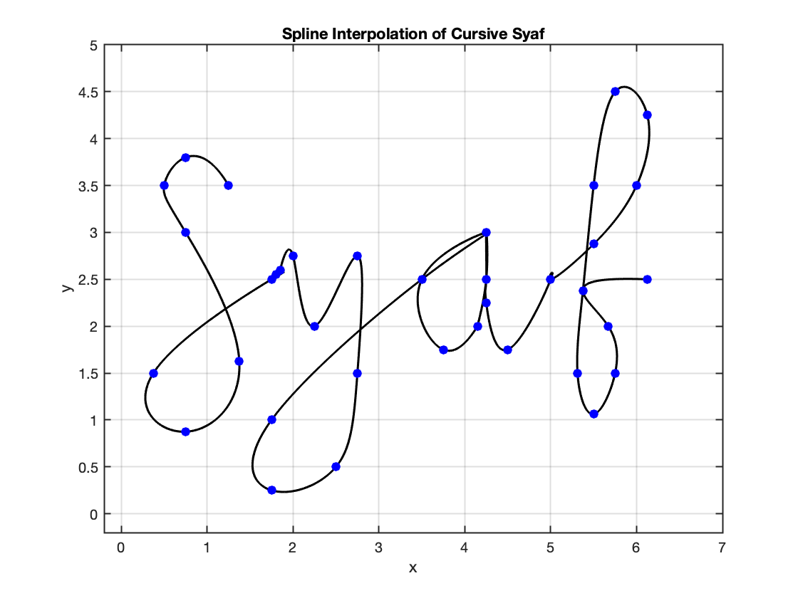

# SM2302 - Group Assignment 2 (Let's Git It)
## Spline Your Name 


| Student ID \# | Name            | Nickname |
|---------------|-----------------|----------|
| 22B2046       | Syafiqah Raddin | Syaf     |
| 22B2125       | Izznie Adanan   | Izz      |
| 22B2149       | Aqilah Rafidi   | Qila     |  
| 22B9014       | Bibi Junaidi    | Bibi     |

## Table of Contents

1.  [Graph Paper Transcription](#graph-paper-transcription)
2.  [Digital Reconstruction](#digital-reconstruction)
3.  [Creation Of The Plotword Function](#creation-of-the-plotword-function)

### Graph Paper Transcription

Initially, we did a rough sketch of our nicknames in cursive on a square plot. 
We selected only 9 letters in this task, which are: a, b, f, i, l, q, s, y, and z.

Additionally, we noted the exact coordinates from the rough sketch to be plotted on the square plot.
Furthermore, each cursive letter starts and ends with the same y value, which in this case is y = 2.5. 
This is to make sure when we plot our names, the letters would connect the way a cursive word would. 
This a reminder that for what we have done so far, the coordinates are only important for their dimension for now, and we have not yet considered where the position of the letters will be in words (which will be handled in the later tasks).

We can observe this from the rough sketch of the graph plot below in Figure 1 and Figure 2:

#### *Figure 1*


#### *Figure 2*


From our rough sketch, we can easily plot this in Matlab, referring to the individualLetters.m file with the help of the Dcursive.m file given, 

below is an example of letter f (Figure 3):

```r
%% LETTER F
% Define data points for x and y coordinates 
x = [0.5 1 1.5 1.625 1.25 1 0.875 0.8125 1 1.25 1.17 0.875 1.625];
y = [2.5 2.875 3.5 4.25 4.5 3.5 2.375 1.5 1.0625 1.5 2 2.375 2.5];

n = length(x);
t = 0:n-1; % Parametric coordinate t
tt = 0:0.01:n-1; % More dense coordinate tt for spline interpolation

% Compute spline interpolation
xx = spline(t, x, tt);
yy = spline(t, y, tt);

% Plot settings
figure(1)
plot(xx, yy, 'k', 'LineWidth', 1.5) % plot spline
hold on
plot(x, y, 'bo', 'MarkerFaceColor', 'b') % plot data points
axis([-0.2 6 -0.2 4.5])
grid on
title('Spline Interpolation of Cursive Letter F')
xlabel('x')
ylabel('y')
set(gca, 'FontSize', 10, 'LineWidth', 1)
grid on
```
for each letter, the only difference is to data points for the x and y coordinates and the title in the plot settings. 

#### *Figure 3*


### Digital Reconstruction
For this task, we now try to do a MatLab script file that would plot all of our spline cursive names (as words, not letters). In this, we are using subplots to arrange each name plot to be placed in the same figure. 

In Figure 4, you can see an example, syaf. 

```c
%% syaf
% letter s
x1 = [1.25 0.75 0.5 0.75 1.375 0.75 0.375 1.75];
y1 = [3.5 3.8 3.5 3 1.625 0.875 1.5 2.5];

% letter y 
x2 = [0.5 0.55 0.6 0.75 1 1.5 1.5 1.25 0.5 0.5 2.25];
y2 = [2.5 2.55 2.6 2.75 2 2.75 1.5 0.5 0.25 1 2.5];

% Define the amount of shift to the right (offset)
x_shift2 = 1.25;

% Apply the offset to x coordinates (horizontal) 
x2 = x2 + x_shift2;

% letter a
x3 = [1 0.25 0.5 0.9 0.9 1 1 1 1 1.25 1.75];
y3  = [3 2.5 1.75 2 2 2.5 3 2.5 2.25 1.75 2.5];

% Define the amount of shift to the right (offset)
x_shift3 = 3.25;

% Apply the offset to x coordinates (horizontal) 
x3 = x3 + x_shift3;

% LETTER F
% Define data points for x and y coordinates 
x4 = [0.5 1 1.5 1.625 1.25 1 0.875 0.8125 1 1.25 1.17 0.875 1.625];
y4 = [2.5 2.875 3.5 4.25 4.5 3.5 2.375 1.5 1.0625 1.5 2 2.375 2.5];

% Define the amount of shift to the right (offset)
x_shift4 = 4.5;

% Apply the offset to x coordinates (horizontal) 
x4 = x4 + x_shift4;

% Concatenate data points
x = [x1 x2 x3 x4];
y = [y1 y2 y3 y4];

n = length(x);
t = 0:n-1; % Parametric coordinate t
tt = 0:0.01:n-1; % More dense coordinate tt for spline interpolation

% Compute spline interpolation
xx = spline(t, x, tt);
yy = spline(t, y, tt);

% Plot settings
figure(3)
plot(xx, yy, 'k', 'LineWidth', 1.5) % plot spline
hold on
plot(x, y, 'bo', 'MarkerFaceColor', 'b') % plot data points
axis([-0.2 7 -0.2 5])
grid on
title('Spline Interpolation of Cursive Syaf')
xlabel('x')
ylabel('y')
set(gca, 'FontSize', 10, 'LineWidth', 1)
grid on

```
#### *Figure 4*


Code explanation for names.m file: 

1. To better see each name, we used the %% function in Matlab to section break between all our nicknames.   
2. When computing a name, to make it less confusing and also to avoid the plot (X, Y) to overlap with other letters in the graph plot, 
we let (X, Y) be (X1, Y1), (X2, Y2), ..., (Xn, Yn) for each letter in each name.  
For example, for the name qila, the letter q would be (X1, Y1) and then the letter i would be (X2, Y2) and so on. 
3. Moreover, to make sure each name will come out as different graph plots (different figures)
instead of all the names running on one graph plot (one figure), we changed the title, figure numbers
and also the (X, Y) axis so it can show better. Basically, each member is named Figure 1, figure 2 and more.
This is under the `plot settings` in the code. 


### Creation Of The Plotword Function 

Lastly, this section develops a script function called 'plotWord.m'. For this part, we created a  method for combining letters into cursive words.
For example, our letters are A, B, F, I, and L; then it will be 'lab', 'ball' and more.
For this function script, we consider using the 'containers.map' to hold data.
Below is the function script for the PlotWord function.

```
```

Code explanation:
1. For our code, we use `nargin` to check if the number of input arguments is less than 1, meaning the function has been called without providing any input arguments.
2. We assign `letterMap = containers.map` then define `containers.map`.
3. For our letters, we assign a representation of points in array format, making it a convenient way to express points or data in a compact form.
4. Set our array elements at [0 0]
5. Using `for-loop` to loop through the letters and draw.
6. For the special character, in our case, 'i', we use ` `
7. ` t = 1:0.01:length(allX); ` to create a time vector, `t` ranging from 1 to the length of `allX` with a step size of 0.01. This vector is used as the time or independent variable for the interpolation.
For `interpolatedX` and `interpolatedY` contain the interpolated coordinates that can be used for plotting a smooth curve that represents the shape formed by the letters.
8. Plot the data using `interpolatedX` and interpolatedY`.
9. Customizing the appearance of the plot to ensure equal scaling on both axes and labelling the plotted data.

Try code on input strings `plotWords('ball')` , it will give the plot below (Figure 5):

#### *Figure 5*

